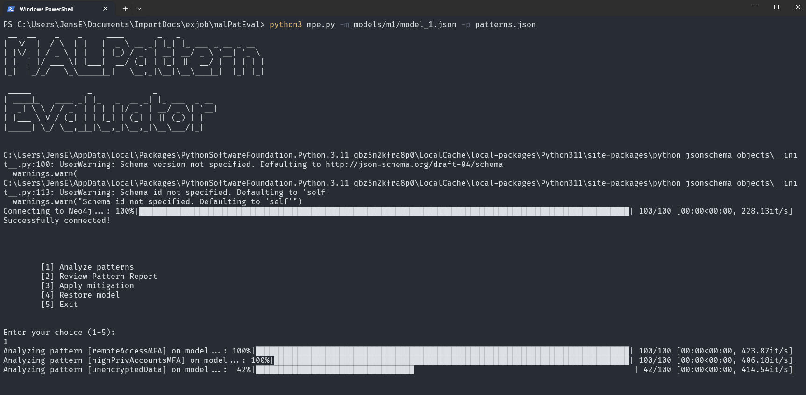

# malPatternEvaluator
A CLI tool to evaluate structural patterns derived from the MITRE ATT&CK framework on coreLang models using the Neo4j graph database. 
The pattern collection consists of 25 different patterns capable of identifying specific components in a model where structural defenses can be applied. In total 14 unique structural defenses are proposed that can alter the available attack paths generated in an attack graph.

## Installment
1. git clone https://github.com/JensEk/malPatternEvaluator.git
2. pip install -r requirements.txt
3. Install Neo4j Desktop:
   - https://neo4j.com/docs/desktop-manual/current/
5. Connect to Neo4j desktop instance:
     uri="bolt://localhost:7687",
     username="neo4j",
     password="dynp12345!",
     dbname="neo4j",

## Usage
1. Compile coreLang model using the MAL-Toolbox or use the example models provided in the /models directory
2. python3 mpe.py -m models/mX/model_X.json -p patterns.json

## Pattern collection
Each pattern consists of two sub-patterns (BadPattern & MitigationPattern) that are encoded into Cypher queries that can be processed by the Neo4j graph database. The *BadPattern* blueprint identifies the components that may pose a threat and the *MitigationPattern* blueprint propose the structural changes.
To provide additional security guidance, a mapping has been made from each pattern to a selection of ATT&CK Technique and Mitigation IDs.

| Group of patterns | Pattern name | BadPattern description | Mitigation-Pattern description | ATT&CK IDs |
| ----------------- | ------------ | ---------------------- | ----------------------------- | ---------- |
| IAM | remoteAccessMFA | Identifies [Credentials] linked to [Application] with name matching of remote access where association {ConditionalAuthentication} is missing. | Add [Credentials] with {ConditionalAuthentication} to the identified [Credentials] where MFA is missing. | **_Initial Access:_** [T1133, T1078], **_Persistence:_** [T1078], **_Credential Access:_** [T1110], **_Mitigation:_** [M1036, M1032, M1030, M1017] |
| IAM | highPrivAccountsMFA | Identifies [Credentials] linked to [User] associated [Identity] with extended privileges where association {ConditionalAuthentication} is missing. | Add [Credentials] with {ConditionalAuthentication} to the identified [Credentials] where MFA is missing. | **_Privilege Escalation:_** [T1078], **_Defense Evasion:_** [T1078], **_Credential Access:_** [T1110], **_Mitigation:_** [M1032, M1027, M1026] |
| IAM | shadowAdmin | Identifies [User] associated [Identity] with {highPrivAppIAMs} association to [Application] where name is not matching admin/root. | Remove {highPrivAppIAMs} from the identified [Identity] and add {lowPrivAppIAMs} instead. | **_Initial Access:_** [T1078], **_Privilege Escalation:_** [T1078], **_Mitigation:_** [M1032, M1018, M1026, M1036] |
| IAM | groupIdentityAppMismatch | Identifies [Identity] with {memberOf} association to a [Group] where the [Identity] has different privileges than the [Group] on an [Application]. | Remove the association between identified [Identity] and [Application]. | **_Privilege Escalation:_** [T1078], **_Discovery:_** [T1613, T1046], **_Mitigation:_** [M1026] |
| IAM | groupIdentityDataMismatch | Identifies [Identity] with {memberOf} association to a [Group] where the [Identity] has different privileges than the [Group] on a [Data]. | Remove the association between identified [Identity] and [Application]. | **_Privilege Escalation:_** [T1078], **_Discovery:_** [T1613, T1046], **_Mitigation:_** [M1026] |
| IAM | highPrivServiceAccounts | Identifies [Identity] with name matching of service account with {highPrivAppIAMs} association. | Remove [Identity] from [Network] and add it to new segmented [Network]. | **_Privilege Escalation:_** [T1078], **_Discovery:_** [T1087], **_Lateral Movement:_** [T1072, T1021], **_Mitigation:_** [M1027, M1036, M1035, M1030, M1033] |
| IAM | accountManagerMFA | Identifies [Identity] with {managers} association to another [Group], [Identity], or [Privileges] where association {ConditionalAuthentication} is missing. | Add [Credentials] with {ConditionalAuthentication} to the identified [Credentials] where MFA is missing. | **_Persistence:_** [T1098, T1136], **_Impact:_** [T1531], **_Mitigation:_** [M1032, M1026] |
| IAM | identityDiscovery | Identifies [Application] with multiple associated [Identity] with different types of privileges on the [Application]. | Delete the association between identified [Identity] and [Application], then add a new anonymous [Identity] with {CanAssume} to sensitive [Identity]. | **_Discovery:_** [T1087], **_Mitigation:_** M1028 |
| ComputeResources | userExposedHardware | Identifies [Hardware] with {hostHardware} association to a [Network] linked [Application] where a [User] is not matching name of [Hardware]. | Remove the association between identified [Hardware] and [User], then add new [PhysicalZone] with {ZoneInclusion} to the [Hardware] to restrict access. | **_Initial Access:_** [T1200, T1091], **_Lateral Movement:_** [T1091], **_Mitigation:_** [M1034, M1040] |
| ComputeResources | zoneExposedHardware | Identifies [Hardware] where [User] is not associated with the [PhysicalZone] linked to the [Hardware]. | Remove the association between identified [Hardware] and [User]. | **_Initial Access:_** [T1200, T1091], **_Lateral Movement:_** [T1091], **_Mitigation:_** [M1034, M1040] |
| ComputeResources | supplyChainVulnApp | Identifies [Application] with associated [SoftwareProduct] where no {protectedApps} association to an [IDPS] exists. | Add [IDPS] with association {AppProtection} to the identified [Application]. | **_Initial Access:_** [T1195], **_Mitigation:_** [M1016, M1051, M1033] |
| ComputeResources | containerCompromise | Identifies [Application] with name matching of containerized services where [Identity] with extended privileges exists. | Add [IDPS] to the identified [Application]. | **_Execution:_** [T1610], **_Privilege Escalation:_** [T1611], **_Discovery:_** [T1613], **_Mitigation:_** [M1047, M1048, M1038] |
| ComputeResources | taintSharedStorage | Identifies [Data] that is hosted on [Hardware] or contained in [Application] where multiple [Identity] have write privileges indicating shared storage. | Remove the association between identified [Data] and [Identity] to restrict access. | **_Lateral Movement:_** [T1080], **_Mitigation:_** [M1022, M1049] |
| ComputeResources | remoteAccessC2 | Identifies [Application] with name matching of remote access tools where no {protectedApps} association to an [IDPS] exists. | Add [IDPS] to the identified [Application]. | **_Command and Control:_** [T1219], **_Exfiltration:_** [T1041], **_Mitigation:_** [M1031, M1037] |
| DataResources | unencryptedData | Identifies [Data] linked to [Application] where associated {encryptCreds} are missing. | Add [Credentials] with {EncryptionCredentials} to the identified [Data] where encryption is missing. | **_Credentials Access:_** [T1552, T1555], **_Collection:_** [T1005, T1039], **_Impact:_** [T1565], **_Mitigation:_** [M1041, M1047, M1027, M1057] |
| DataResources | unencryptedInfo | Identifies [Information] linked to [Data] where associated {encryptCreds} are missing. | Add [Credentials] with {EncryptionCredentials} to the identified [Data] where encryption is missing. | **_Credentials Access:_** [T1552, T1555], **_Collection:_** [T1005, T1039], **_Impact:_** [T1565], **_Mitigation:_** [M1041, M1047, M1027, M1057] |
| DataResources | dataAiTM | Identifies [Data] with association {transitData} to a [Network] where [User] have physical access to the [Network]. | Remove the {DataInTransit} association between identified [Data] and [Network], then transit over new [Network]. | **_Credential Access:_** [T1557, T1040], **_Collection:_** [T1557], **_Mitigations:_** [M1041, M1037, M1035] |
| DataResources | dataDestruction | Identifies [Data] where [Identity] is associated with {writingIAMs} or {deletingIAMs}. | Add new [Data] as backup and add it to new [Hardware] for offline backup. | **_Impact:_** [T1485, T1486, T1561], **_Mitigation:_** [M1053] |
| Network | activeNetworkScan | Identifies [Network] with connected [Application] where [Network] is not identified as DMZ but with {ingoingNetConnections} association to [RoutingFirewall]. | Remove {ingoingNetConnections} to the identified [Network] and add {outgoingNetConnections} instead. | **_Reconnaissance:_** [T1595, T1590], **_Discovery:_** [T1046], **_Mitigation:_** [M1056] |
| Network | nonSegmentedPublicApp | Identifies [Application] with name matching as an internet-facing service with {ingoingAppConnections} association to [Network] which is not identified as DMZ. | Remove the association between identified [Application] and [Network], then add it to a new segmented [Network]. | **_Initial Access:_** [T1190, T1133], **_Lateral Movement:_** [T1210], **_Mitigation:_** [M1030] |
| Network | networkPerimeterCompromise | Identifies [RoutingFirewall] with associated [Application] or [Hardware] where [Identity] is linked to it. | Add [Credentials] with {ConditionalAuthentication} to the identified [Credentials] where MFA is missing. Then add [IDPS] to the identified [Application]. | **_Defense Evasion:_** [T1599], **_Mitigation:_** [M1043, M1032, M1027] |
| User | userExposedNetworks | Identifies [Network] where [User] exists but [IDPS] or other [Application] matching a security tool is missing. | Add [IDPS] between the [RoutingFirewall] and [Network] where [User] exists. | **_Initial Access:_** [T1566], **_Execution:_** [T1204], **_Lateral Movement:_** [T1534], **_Mitigation:_** [M1049, M1031, M1017] |
| User | userImpersonation | Identifies [User] with associated [Identity] that is linked to another [User]. | Add [Credentials] with {ConditionalAuthentication} to the identified [Credentials] where MFA is missing. | **_Defense Evasion:_** [T1656], **_Mitigation:_** [M1019, M1017] |
| Vulnerability | exploitVulnerablePublicApp | Identifies [Application] linked to [SoftwareVulnerability] with association {ingoingAppConnections} to [Network] not identified as DMZ. | Remove [ConnectionRule] from [Application] to the [Network], then assign it to a new segmented [Network]. | **_Initial Access:_** [T1190], **_Mitigation:_** [M1030, M1051, M1016] |
| Vulnerability | exploitVulnerableApp | Identifies [SoftwareVulnerability] linked to an [Application] or [SoftwareProduct] with associated [Identity]. | Remove any associations to [Application] except the ones to [SoftwareVulnerability] and [SoftwareProduct] to isolate. | **_Execution:_** [T1203], **_Privilege Escalation:_** [T1068], **_Defense Evasion:_** [T1211], **_Credential Access:_** [T1212], **_Mitigation:_** [M1051, M1048, M1019] |
